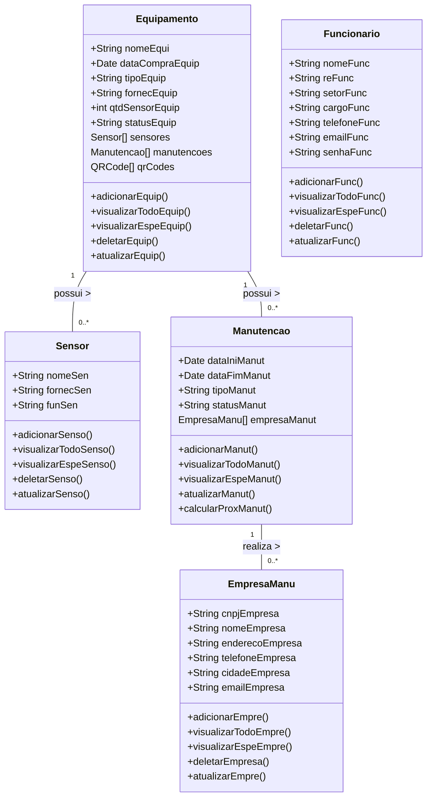

# Sistema de Controle de Manutenções e Equipamentos

## Descrição
O Sistema de Controle de Manutenções e Equipamentos será desenvolvido para gerenciar as manutenções de máquinas, registrando as atualizações diárias e criando um histórico detalhado. O sistema permitirá a diferenciação de acessos entre administradores, gerentes e funcionários, proporcionando funcionalidades específicas para cada grupo. Através de sensores, o sistema monitorará o funcionamento dos equipamentos e gerará relatórios pertinentes para a gestão eficiente e a tomada de decisões.

## Funcionalidades
- **Registro de Manutenções:** 
- **Relatórios Personalizados:** 
- **Notificações de Manutenção:** 

## Escopo do Sistema
- **1. Cadastro e Gerenciamento de Equipamentos**
  - **Cadastro Completo:** 
  - **CRUD de Equipamentos:** 
  - **Histórico de Manutenções:** 

- **2. Gerenciamento de Funcionários**
  - **Cadastro de Funcionários:** 
  - **CRUD de Funcionários:** 

- **3. Controle de Manutenção**
  - **Inserção de Dados de Manutenção:** 
  - **Relatórios de Manutenção:** 
  - **Indicação de Empresas de Manutenção:** 

- **4. Monitoramento de Sensores**
  - **Integração com Sensores:** 
  - **Relatórios de Funcionamento:** 

- **5. Estrutura do Banco de Dados Não Relacional**
  - **Modelo de Dados:**
    - **Equipamento:**
      - Campos: `nomeEquip`, `dataCompraEquip`, `tipoEquip`, `fornecEquip`, `qtdSensorEquip`, `statusEquip`.
      - Relações: `Sensor` e `Manutencao`.
    - **Funcionarios:**
      - Campos: `nomeFunc`, `reFunc`, `setorFunc`, `cargoFunc`, `telefoneFunc`, `emailFunc`, `senhaFunc`.

- **6. API's e Métodos**
  - **API para Exibição de Relatórios:** 
  - **Métodos:**
    - **Equipamento:** 
      - `adicionarEquip()`
      - `visualizarTodoEquip()`
      - `visualizarEspeEquip()`
      - `deletarEquip()`
      - `atualizarEquip()`
    - **Sensor:**
      - `adicionarSenso()`
      - `visualizarTodoSenso()`
      - `visualizarEspeSenso()`
      - `deletarSenso()`
      - `atualizarSenso()`
    - **Dados:**
      - `adicionarDados()`
    - **Manutencao:**
      - `adicionarManut()`
      - `visualizarTodoManut()`
      - `visualizarEspeManut()`
      - `atualizarManut()`
      - `calcularProxManut()`
    - **EmpresaManu:**
      - `adicionarEmpre()`
      - `visualizarTodoEmpre()`
      - `visualizarEspeEmpre()`
      - `deletarEmpresa()`
      - `atualizarEmpre()`
    - **Funcionario:**
      - `adicionarFunc()`
      - `visualizarTodoFunc()`
      - `visualizarEspeFunc()`
      - `deletarFunc()`
      - `atualizarFunc()`

- **7. Níveis de Acesso**
  - **Admin:** 
  - **Gerente:** 
  - **Funcionário:** 

## Manual do Usuário

### Funcionalidades Principais:

- **1. Página Inicial (Home)**
  - O usuário pode escolher acessar o sistema de duas maneiras:
    - **Página de Login:** 
    - **Página de Cadastro:** 

- **2. Cadastro**
  - O usuário pode acessar a página de **Cadastro** e, após o cadastro, é redirecionado para a página de login.

- **3. Página de Equipamentos**
  - Uma vez logado, o usuário tem acesso à lista de equipamentos e pode:
    - Selecionar um equipamento da lista.
    - Gerar relatórios ou QR Codes.
    - Atualizar as informações do equipamento.

### Fluxo de Acesso ao Sistema

- **1. Login**
  - Requer login para acessar a lista de equipamentos e funcionalidades avançadas.
  
- **2. Página de Equipamentos**
  - **Gerente:** Acesso a geração de QR Code e relatórios.

- **3. Manutenções**
  - Possibilita geração de relatórios de manutenções.

### Relatórios e Gerenciamento de Equipamentos

- **Relatórios de Manutenção:** Visualização completa de manutenção preventiva e corretiva.
- **API de QR Code:** Opção de gerar novos QR Codes para equipamentos.

## Diagramas
### Diagrama de Estrutura do Banco de Dados
### Diagrama de Classe

### Diagrama de Fluxo

### Diagrama de Casos de Uso

## Tecnologias Utilizadas
- **Frontend:** Java Swing
- **Backend:** Java
- **Banco de Dados:** MongoDB

## Considerações Finais
O Sistema de Controle de Manutenções e Equipamentos visa proporcionar uma gestão eficiente e eficaz das máquinas, minimizando downtime e garantindo que as operações da empresa sejam realizadas de forma otimizada.
