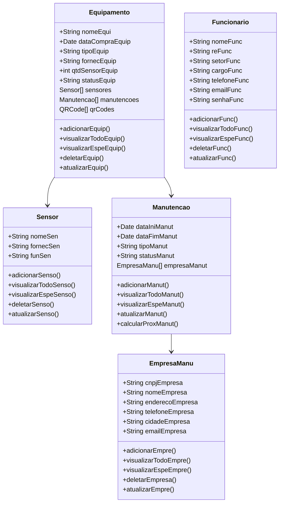
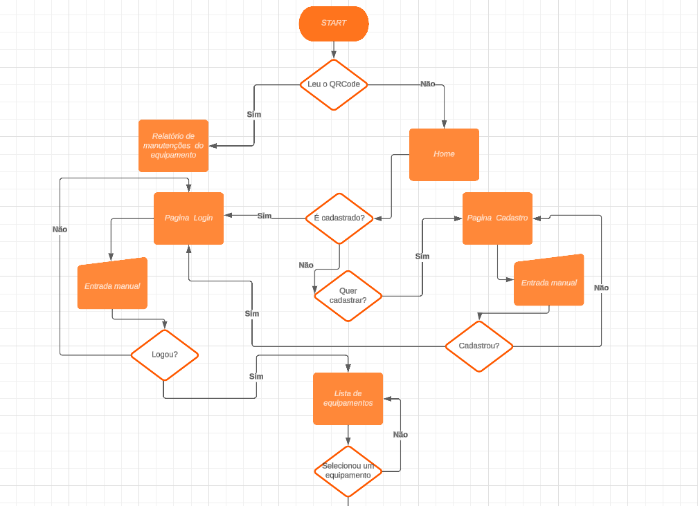
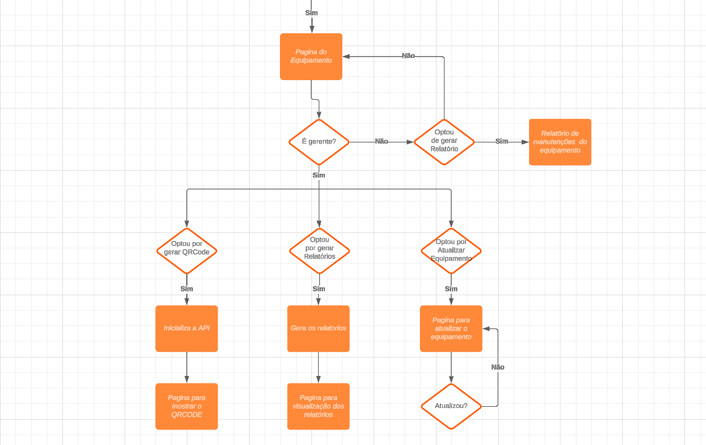
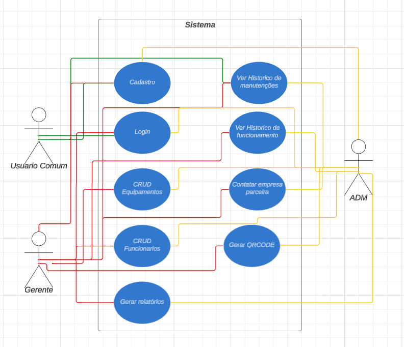

# Sistema de Controle de Manutenções e Equipamentos

## Descrição
O Sistema de Controle de Manutenções e Equipamentos será desenvolvido para gerenciar as manutenções de máquinas, registrando as atualizações diárias e criando um histórico detalhado. O sistema permitirá a diferenciação de acessos entre administradores, gerentes e funcionários, proporcionando funcionalidades específicas para cada grupo. Através de sensores, o sistema monitorará o funcionamento dos equipamentos e gerará relatórios pertinentes para a gestão eficiente e a tomada de decisões.

## Funcionalidades
- **Registro de Manutenções:** Permite o registro de manutenções preventivas e corretivas, garantindo que todas as intervenções sejam documentadas.
- **Relatórios Personalizados:** Geração de relatórios de manutenção e funcionamento que podem ser filtrados por data, tipo de manutenção e status do equipamento.
- **Notificações de Manutenção:** O sistema poderá enviar alertas para gerentes sobre manutenções preventivas programadas, garantindo que as máquinas sejam mantidas em condições ideais de operação.

## Escopo do Sistema

### 1. Cadastro e Gerenciamento de Equipamentos
- **Cadastro Completo:** Permitir o cadastro de equipamentos com informações como nome, data de compra, tipo, fornecedor, quantidade de sensores e status.
- **CRUD de Equipamentos:** Possibilitar a criação, leitura, atualização e exclusão (CRUD) dos registros de equipamentos.
- **Histórico de Manutenções:** Registrar cada manutenção realizada, incluindo informações da empresa responsável, tipo de manutenção, status e datas de início e fim.

### 2. Gerenciamento de Funcionários
- **Cadastro de Funcionários:** Permitir o cadastro com informações pessoais (nome, registro, setor, cargo, telefone, e-mail, senha).
- **CRUD de Funcionários:** Implementar funcionalidades para criar, visualizar, atualizar e deletar registros de funcionários.

### 3. Controle de Manutenção
- **Inserção de Dados de Manutenção:** Permitir que os gerentes insiram informações sobre as manutenções realizadas e agendem manutenções preventivas ou corretivas.
- **Relatórios de Manutenção:** Gerar relatórios detalhados sobre as manutenções, incluindo histórico e status dos equipamentos.
- **Indicação de Empresas de Manutenção:** Listar empresas parceiras para a realização de manutenções, com informações de contato.

### 4. Monitoramento de Sensores
- **Integração com Sensores:** O sistema deverá se integrar a sensores instalados nos equipamentos para monitorar a velocidade e a quantidade de acionamentos.
- **Relatórios de Funcionamento:** Gerar relatórios que indiquem variações nos dados dos sensores, sinalizando possíveis problemas nos equipamentos.

### 5. Estrutura do Banco de Dados Não Relacional
- **Modelo de Dados:**
  - **Equipamento:**
    - Campos: `nomeEquip`, `dataCompraEquip`, `tipoEquip`, `fornecEquip`, `qtdSensorEquip`, `statusEquip`.
    - Relações: `Sensor` (com dados de funcionamento) e `Manutencao` (com histórico de manutenções).
  - **Funcionarios:**
    - Campos: `nomeFunc`, `reFunc`, `setorFunc`, `cargoFunc`, `telefoneFunc`, `emailFunc`, `senhaFunc`.

### 6. API's e Métodos
- **API para Exibição de Relatórios:** Desenvolvimento de uma aplicação web para visualizar relatórios.
- **Métodos:**
  - **Equipamento:** 
    - `adicionarEquip()`
    - `visualizarTodoEquip()`
    - `visualizarEspeEquip()`
    - `deletarEquip()`
    - `atualizarEquip()`
  - **Sensor:**
    - `adicionarSenso()`
    - `visualizarTodoSenso()`
    - `visualizarEspeSenso()`
    - `deletarSenso()`
    - `atualizarSenso()`
  - **Dados:**
    - `adicionarDados()`
  - **Manutencao:**
    - `adicionarManut()`
    - `visualizarTodoManut()`
    - `visualizarEspeManut()`
    - `atualizarManut()`
    - `calcularProxManut()`
  - **EmpresaManu:**
    - `adicionarEmpre()`
    - `visualizarTodoEmpre()`
    - `visualizarEspeEmpre()`
    - `deletarEmpresa()`
    - `atualizarEmpre()`
  - **Funcionario:**
    - `adicionarFunc()`
    - `visualizarTodoFunc()`
    - `visualizarEspeFunc()`
    - `deletarFunc()`
    - `atualizarFunc()`

### 7. Níveis de Acesso
- **Admin:** Acesso total ao sistema, incluindo gestão de funcionários e equipamentos.
- **Gerente:** Acesso a relatórios diários de produção e histórico de manutenções, com possibilidade de contato com empresas de manutenção.
- **Funcionário:** Acesso apenas para visualizar informações pertinentes ao seu trabalho, sem permissões para edição.

## Diagramas
### Diagrama de Estrutura do Banco de Dados
### Diagrama de Classe
# Sistema de Controle de Manutenções e Equipamentos

## Diagrama de Classes

### Diagrama de Fluxo

### Diagrama de Casos de Uso

## Tecnologias Utilizadas
- **Frontend:** Java Swing
- **Backend:** Java
- **Banco de Dados:** MongoDB

## Considerações Finais
O Sistema de Controle de Manutenções e Equipamentos visa proporcionar uma gestão eficiente e eficaz das máquinas, minimizando downtime e garantindo que as operações da empresa sejam realizadas de forma otimizada.
